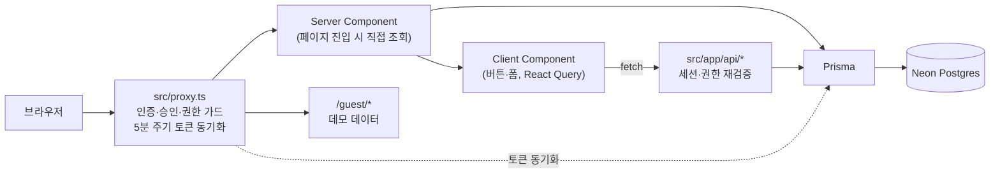
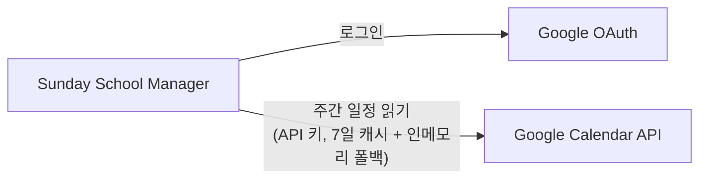
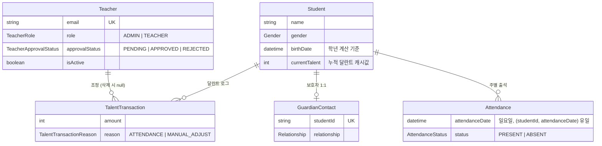

# Sunday School Manager

서광주일학교의 출석·학생·교사를 관리하는 내부 서비스입니다. 교사만 사용하며, 관리자 교사가 가입을 승인합니다.
무료·저비용 운영이 최우선 제약입니다(Vercel + Neon 무료 플랜).

로그인 없이 둘러보려면 로그인 페이지의 **"로그인 없이 둘러보기"** 를 누르세요(`/guest`, 데모 데이터만 표시).

## 주요 기능

- **출석 관리**: 일요일 단위(주 1회) 출석/결석 토글. 출석하면 달란트 +1, 출석을 취소하면 -1이 자동 반영됩니다.
- **달란트**: 학생 포인트. 출석 연동 지급과 수동 조정을 증감 로그로 남기고, 관리자는 전체 초기화를 할 수 있습니다.
- **학생 관리**: 학생·보호자 정보 등록·수정·삭제, 학생별 출석부. 학년은 생년월일로 자동 계산되고, 졸업생은 별도 패널로 분리됩니다.
- **교사 정보**: 교사 목록과 본인 정보 수정. 관리자는 모든 교사를 수정할 수 있습니다.
- **가입 관리(관리자)**: Google 로그인으로 가입한 교사의 승인·거절, 권한 변경, 삭제.
- **대시보드**: 금주 출석 수, 13주 출석 추이, 분기 생일 학생, 이달 생일 교사, 구글 캘린더의 주간 일정(사회·단상).
- **게스트 둘러보기**: 대시보드·출석·학생·교사 화면을 데모 데이터로 공개합니다. DB를 조회하지 않고, 쓰기 버튼도 없습니다.

## 기술 스택

| 영역 | 사용 기술 |
|---|---|
| 프레임워크 | Next.js 16 (App Router), React 19, TypeScript |
| 인증 | next-auth v4 + Google OAuth, JWT 세션 |
| DB | Neon Postgres + Prisma 6 |
| 서버 상태 | TanStack Query v5 |
| 스타일 | Tailwind CSS v4 + 전역 CSS 변수(`--color-*`) |
| 검증 | Zod v4 |
| 테스트 | Vitest |
| 배포 | Vercel |

## 아키텍처

### 요청 흐름



- **조회**는 Server Component에서 Prisma로 직접 합니다.
- **클릭에 즉시 반응해야 하는 동작**(출석 토글, 등록·수정·삭제)은 클라이언트 컴포넌트가 API route를 호출합니다. 출석 화면은 React Query 낙관적 업데이트를 씁니다.
- **권한**은 proxy와 각 API route에서 서버가 최종 판정합니다. 클라이언트 판정은 신뢰하지 않습니다.
- `getServerSession`은 세션 쿠키를 갱신하지 않습니다. 그래서 proxy가 5분마다 DB의 승인 상태·권한을 읽어 세션 쿠키를 다시 발급합니다. 덕분에 승인·거절·삭제가 재로그인 없이 반영됩니다.

### 외부 연동



캘린더 일정은 대시보드의 새로고침 버튼으로 바로 갱신할 수 있습니다.

### 데이터 모델



전체 스키마는 [`prisma/schema.prisma`](prisma/schema.prisma)에 있습니다.

### 렌더링 방식

모든 페이지가 **동적 SSR**입니다. ISR/SSG는 쓰지 않습니다. 화면이 로그인한 교사에 따라 달라지는 개인정보(학생 연락처·보호자 등)라서 정적 생성이나 재검증 캐시가 맞지 않습니다.

## 프로젝트 구조

```
src/
├── proxy.ts              # 전 라우트 인증·승인·권한 가드 (Next.js 16의 middleware)
├── app/                  # App Router 페이지 (폴더명 kebab-case)
│   ├── api/              # API route (모든 쓰기 동작)
│   ├── dashboard/        # 대시보드
│   ├── attendance/       # 출석 관리
│   ├── students/         # 학생 관리
│   ├── teachers/         # 교사 정보
│   ├── signup-management/# 가입 관리 (ADMIN)
│   ├── guest/            # 게스트 둘러보기 (데모 데이터)
│   ├── recreation/       # 레크레이션 도구 (숫자야구, 타이머)
│   └── login, pending, rejected/
├── components/           # 공통·레이아웃 컴포넌트
├── lib/                  # 인증, 세션 가드, 입력 검증, Prisma 클라이언트
├── server/               # 서버 전용 로직 (출석 서비스, 캘린더, 게스트 데모 데이터)
├── utils/                # 날짜(KST)·학년 계산
├── hooks/
└── types/
prisma/                   # 스키마, 마이그레이션
docs/                     # 기획·정책·계획 문서
```

## 개발

### 요구 사항

- Node.js 20.9 이상 (Next.js 16 요구 사항)
- yarn v1 (패키지 매니저는 yarn만 사용)

### 환경변수

`.env.local`에 아래 값을 설정합니다. **값은 저장소에 커밋하지 않습니다.**

| 이름 | 용도 |
|---|---|
| `DATABASE_URL` | Neon Postgres 연결 문자열 |
| `AUTH_SECRET` | 세션 JWT 서명 키 |
| `NEXTAUTH_URL` | 서비스 기준 URL (예: `http://localhost:3000`) |
| `GOOGLE_CLIENT_ID` / `GOOGLE_CLIENT_SECRET` | Google OAuth 클라이언트 |
| `ADMIN_EMAILS` | 쉼표로 구분한 관리자 이메일. 이 이메일로 로그인하면 승인 없이 `ADMIN`이 됩니다 |
| `GOOGLE_CALENDAR_ID` / `GOOGLE_CALENDAR_API_KEY` | 대시보드 주간 일정을 읽을 캘린더 |
| `NEXT_PUBLIC_SITE_URL` | (선택) 메타데이터 기준 URL. `NEXTAUTH_URL`이 없을 때 사용 |

### 실행

```bash
yarn install
yarn dev        # .next 캐시를 지우고 개발 서버 실행 (http://localhost:3000)
```

### 검증 (배포 전 필수)

```bash
yarn lint
yarn prettier --check "src/**/*.{ts,tsx,scss}" "src/proxy.ts"
yarn tsc --noEmit
yarn test
yarn prisma validate   # 스키마 변경 시
```

> `yarn build`는 `prisma migrate deploy`를 포함해 실제 DB를 건드립니다. 빌드만 확인하려면 `yarn dotenv -e .env.local -- next build`를 사용하세요.

테스트는 DB 없이 검증할 수 있는 순수 로직과 가드(날짜·학년 계산, 정렬, 입력 검증, 세션 가드, proxy)만 대상으로 합니다.

## 배포

Vercel에 배포합니다. 빌드 명령(`yarn build`)에 `prisma migrate deploy`가 포함돼 있어, 배포할 때 마이그레이션이 운영 DB에 반영됩니다. 환경변수는 Vercel 프로젝트 설정에 위 표와 같은 이름으로 넣습니다.

## 문서

| 문서 | 내용 |
|---|---|
| [`CLAUDE.md`](CLAUDE.md) / [`AGENTS.md`](AGENTS.md) | 코드 작업 규칙 (아키텍처·컨벤션·테스트 정책) |
| [`docs/PRD.md`](docs/PRD.md) | 기능 요구사항 |
| [`docs/PROJECT_POLICY.md`](docs/PROJECT_POLICY.md) | 운영 정책 |
| [`docs/IMPROVEMENT_PLAN.md`](docs/IMPROVEMENT_PLAN.md) | 남은 개선 작업과 결정 사항 |
| [`docs/FEATURE_PLAN.md`](docs/FEATURE_PLAN.md) | 신규 기능 계획 (구글 캘린더 쓰기, 게스트 모드) |
